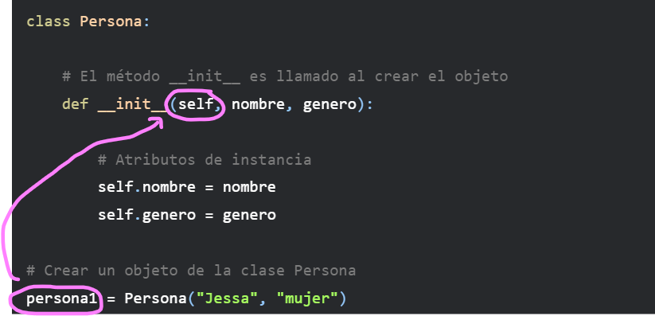
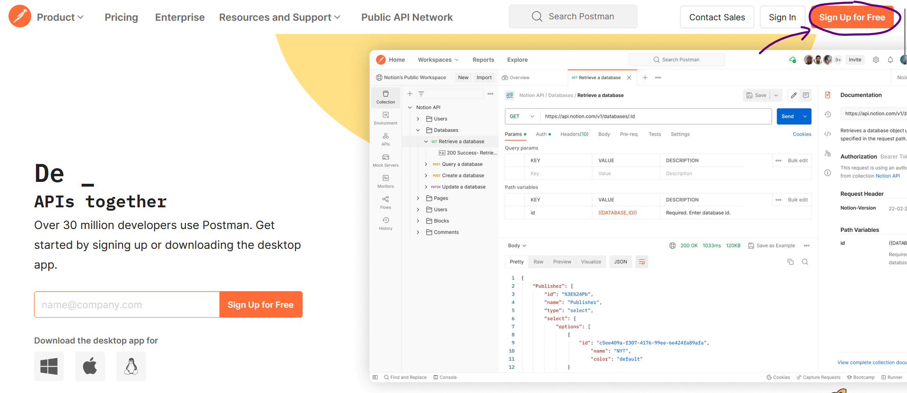
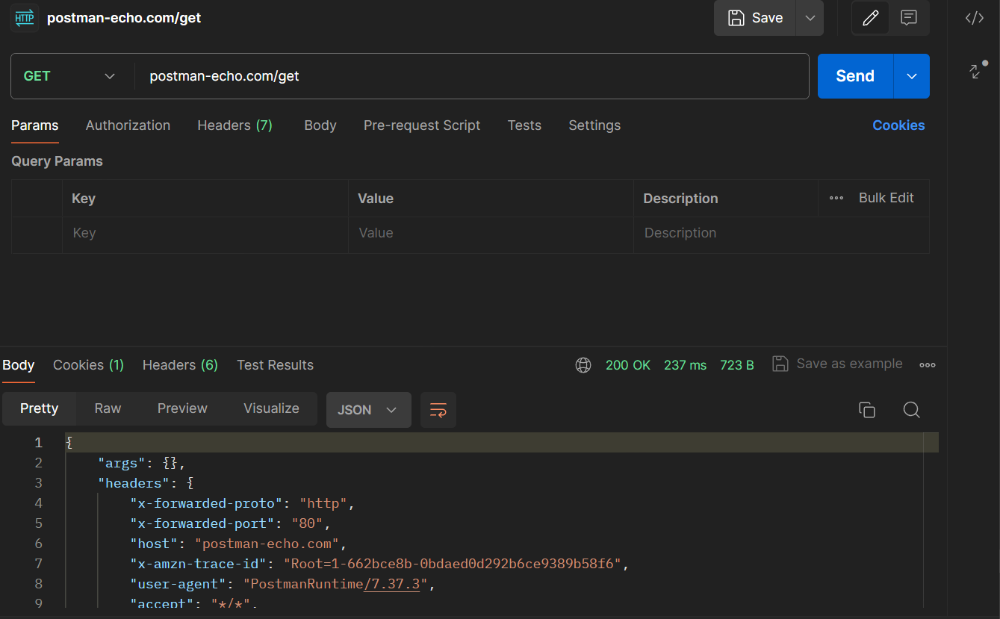
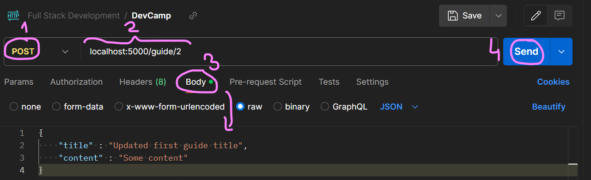

<h1 style="color:#65b5a6; text-decoration: underline; text-align: center;">Checkpoint 06</h1>
<h2 style="color:black; text-align: center;">Full Stack Development Course</h2>
<h3 style="color:#65b5a6; text-align: center;">Autora: <b>M. Alexandra Dodu</b></h3>

# <p style="background-color:white"></p>

# A) EJERCICIO PRÁCTICO

Cree una clase de Python llamada Usuario que use el método init y cree un nombre de usuario y una contraseña. Crea un objeto usando la clase.

```python
class Usuario:
    def __init__(self, usuario, contrasena):
        self.usuario = usuario
        self.contrasena = contrasena

# Crear un objeto de la clase Usuario
usuario1 = Usuario("paquita_salas", "contr123")

# Acceder a los atributos del objeto
print("Nombre de usuario:", usuario1.nombre_usuario)  # Nombre de usuario: paquita_salas
print("Contraseña:", usuario1.contrasena)  # Contraseña: contr123
```

# B) EJERCICIOS TEÓRICOS

## Índice
1. [¿Para qué usamos Clases en Python?](#1-¿Para-qué-usamos-Clases-en-Python?)
2. [¿Qué método se ejecuta automáticamente cuando se crea una instancia de una clase?](#2-qué-método-se-ejecuta-automáticamente-cuando-se-crea-una-instancia-de-una-clase)
3. [¿Cuáles son los tres verbos de API?](#3-cuáles-son-los-tres-verbos-de-api)
4. [¿Es MongoDB una base de datos SQL o NoSQL?](#4-es-mongodb-una-base-de-datos-sql-o-nosql)
5. [¿Qué es una API?](#5-qué-es-una-api)
6. [¿Qué es Postman?](#6-qué-es-postman)
7. [¿Qué es el polimorfismo?](#7-qué-es-el-polimorfismo)
8. [¿Qué es un método dunder?](#8-qué-es-un-método-dunder)
9. [¿Qué es un decorador de Python?](#9-qué-es-un-decorador-de-python)

# <p style="background-color:white"></p>

---

# <p style="background-color:#f7c8c8">1. ¿Para qué usamos Clases en Python?</p>

## 1.1. Definición de clase

Antes que nada, vamos a definir lo que es una clase. Las **clases** en Python son una forma de organizar y estructurar tu código. Proporcionan un mecanismo para definir objetos que pueden contener datos y funciones relacionadas. 

Así, las clases en Python son estructuras que te permiten crear tus propios tipos de datos y organizar la funcionalidad relacionada en un único lugar. Las clases son la base de la programación orientada a objetos (OOP) en Python y se utilizan para modelar objetos del mundo real y abstraer su comportamiento y atributos.

<div style="text-align: center;">
    
</div>

Así, OOP nos permite organizar el código de una manera que se asemeja bastante a como pensamos en la vida real, utilizando, como he mencionado, las **clases**. Estas nos permiten agrupar un conjunto de variables y funciones.

Cosas de lo más cotidianas como una persona o un coche pueden ser representadas con clases. Estas clases tienen diferentes características, que en el caso de la persona podrían ser el nombre, el género o la profesión. Llamaremos a estas características, **atributos**.

Por otro lado, las clases tienen un conjunto de funcionalidades o cosas que pueden hacer. En el caso de la persona podría ser trabajar o estudiar. Llamaremos a estas funcionalidades **métodos**.

Por último, pueden existir diferentes tipos de personas. Podemos tener una que se llama Jessa o y otra que se llama Jon. Llamaremos a estas diferentes personas **objetos**. Es decir, el concepto abstracto de persona es la **clase**, pero Jessa o cualquier otra persona en particular será el **objeto**.

<div style="text-align: center;">
    
</div>

## 1.2. Sintaxis

Vamos a ver brevemente la sintaxis de una clase, ya que es una estructura muy compleja y quiero explicárla antes de hablar de la importancia de estas y, además, entenderla nos va a servir a lo largo de los apartados. 

Lo primero es crear una clase, para ello usaremos el ejemplo de persona. Para definir una clase en Python, se emplea la palabra clave `class`, seguida del nombre de la clase con el primer carácter en mayúscula y dos puntos (`:`). 

```python
# Creando una clase vacía
class Persona:
    pass
```

Se trata de una clase vacía y sin mucha utilidad práctica, pero es la mínima clase que podemos crear. Nótese el uso del `pass` que no hace realmente nada, pero daría un error si después de los `:` no tenemos contenido.

Ahora que tenemos la clase, podemos crear un **objeto** de la misma. Podemos hacerlo como si de una variable normal se tratase. Nombre de la variable igual a la clase con `()`. Dentro de los paréntesis irían los parámetros de entrada si los hubiera.

```python
# Creamos un objeto de la clase persona
persona1 = Persona()
```

### 1.2.1. Atributos

A continuación vamos a añadir algunos **atributos** a nuestra clase. Antes de nada es importante distinguir que existen dos tipos de atributos:

* **Atributos de instancia:** Pertenecen a la instancia de la clase o al objeto. Son atributos particulares de cada instancia, en nuestro caso de cada perro.
* **Atributos de clase:** Se trata de atributos que pertenecen a la clase, por lo tanto serán comunes para todos los objetos.

Empecemos creando un par de atributos de instancia para la persona1, el nombre y el género. Para ello creamos un método `__init__` que será llamado automáticamente cuando creemos un objeto. Se trata del constructor (ver [apartado 2](#2-qué-método-se-ejecuta-automáticamente-cuando-se-crea-una-instancia-de-una-clase) para entender este método). El uso de `__init__` y el doble guión bajo `__` no es una coincidencia. Cuando veas un método con esa forma, significa que está reservado para un uso especial del lenguaje y son conocidos como métodos mágicos. Te lo explico en el [apartado 8](#8-qué-es-un-método-dunder).

```python
class Persona:
    # El método __init__ es llamado al crear el objeto
    def __init__(self, nombre, genero):
        print(f"Creando persona {nombre}, {genero}")

        # Atributos de instancia
        self.nombre = nombre
        self.genero = genero
```

Ahora que hemos definido el método *init* con dos parámetros de entrada, podemos crear el objeto pasando el valor de los atributos. 

```python
persona1 = Persona("Jessa", "mujer")
# Creando persona Jessa, mujer
```

Seguramente te hayas fijado en el `self` que se pasa como parámetro de entrada del método. Es una variable que representa la instancia de la clase, y deberá estar siempre ahí. Te lo explico bien en el apartado 2.

Por último, podemos acceder a los atributos usando el objeto y `.`.

```python
print(persona1.nombre)  # Jessa
print(persona1.genero)  # mujer
```

Hasta ahora hemos definido atributos de instancia, ya que son atributos que pertenecen a cada persona concreta. Ahora vamos a definir un **atributo de clase**, que será común para todas las personas. Por ejemplo, la especie de las personas es algo común para todos los objetos Persona.

```python
class Persona:
    # Atributo de clase
    especie = 'Homo sapiens'

    # El método __init__ es llamado al crear el objeto
    def __init__(self, nombre, genero):
        print(f"Creando persona {nombre}, {genero}")

        # Atributos de instancia
        self.nombre = nombre
        self.genero = genero
```

Dado que es un atributo de clase, no es necesario crear un objeto para acceder al atributos. Podemos hacer lo siguiente:

```python
print(Persona.especie)  
# Homo sapiens
```

Se puede acceder también al atributo de clase desde el objeto.

```python
persona1 = Persona("Jessa", "mujer")
persona1.especie
# Creando persona Jessa, mujer
# 'Homo sapiens'
```

De esta manera, todos los objetos que se creen de la clase perro compartirán ese atributo de clase, ya que pertenecen a la misma.

### 1.2.2. Métodos

En realidad cuando usamos `__init__` anteriormente ya estábamos definiendo un método, solo que uno especial. A continuación, vamos a ver como definir métodos que le den alguna funcionalidad interesante a nuestra clase (denominados **métodos de instancia**), siguiendo con el ejemplo de persona.

Vamos a codificar dos métodos, trabajar y estudiar. El primero no recibirá ningún parámetro y el segundo recibirá el número de temas a estudiar. Como hemos indicado anteriormente, `self` hace referencia a la instancia de la clase. Se puede definir un método con `def` y el nombre, y entre `()` los parámetros de entrada que recibe, donde siempre tendrá que estar `self` el primero.

```python
class Persona:
    # Atributo de clase
    especie = 'Homo sapiens'

    # El método __init__ es llamado al crear el objeto
    def __init__(self, nombre, genero):
        print(f"Creando persona {nombre}, {genero}")

        # Atributos de instancia
        self.nombre = nombre
        self.genero = genero
    
    def trabaja(self):
        print("Trabaja")

    def estudia(self, temas):
        print(f"Lleva estudiando {temas} temas")
```

Por lo tanto, si creamos un objeto `persona1`, podremos hacer uso de sus métodos llamándolos con `.` y el nombre del método. Como si de una función se tratase, pueden recibir y devolver argumentos.

```python
persona1 = Persona("Jessa", "mujer")
persona1.trabaja()
persona1.estudia(2)

# Creando persona Jessa, mujer
# Trabaja
# Lleva estudiando 2 temas
```

### 1.2.3. ¡Practica lo aprendido!

Cree una clase de Python llamada Usuario que use el método *init* y cree un nombre de usuario y una contraseña. Crea un objeto usando la clase.

#### Solución

```python
class Usuario:
    def __init__(self, usuario, contrasena):
        self.usuario = usuario
        self.contrasena = contrasena

# Crear un objeto de la clase Usuario
usuario1 = Usuario("paquita_salas", "contr123")

# Acceder a los atributos del objeto
print("Nombre de usuario:", usuario1.nombre_usuario)  # Nombre de usuario: paquita_salas
print("Contraseña:", usuario1.contrasena)  # Contraseña: contr123
```

### 1.2.4. Bibliografía para profundizar

Como ya he mencionado, las clases son estructuras muy complejas, por lo que te recomiendo varias referencias para profundizar en ellas:

* [Clases (Documentación oficial de Python)](https://docs.python.org/es/3/tutorial/classes.html)
* [Python Classes: The Power of Object-Oriented Programming](https://realpython.com/python-classes/#getting-started-with-python-classes)

## 1.3. Uso de clases

Como te estarás imaginando, las clases en Python ofrecen varias ventajas que las hacen muy útiles para organizar y estructurar el código de manera eficiente:

1. **Reutilización de código:** Las clases permiten encapsular la funcionalidad en unidades cohesivas que pueden ser reutilizadas en diferentes partes de un programa. Esto promueve la modularidad y facilita la reutilización del código, lo que a su vez reduce la duplicación y mejora la mantenibilidad.

2. **Abstracción:** Las clases permiten modelar objetos del mundo real de manera abstracta, lo que facilita la comprensión del código y la comunicación entre los miembros del equipo. Las clases encapsulan el comportamiento y los datos relacionados en una interfaz clara y coherente, ocultando los detalles de implementación subyacentes.

3. **Organización del código:** Las clases proporcionan una forma natural de organizar el código en componentes lógicos y cohesivos. Esto facilita la gestión y la comprensión del código, especialmente en proyectos grandes y complejos.

4. **Herencia:** La herencia permite la creación de jerarquías de clases en las que una clase (clase hija) puede heredar atributos y métodos de otra clase (clase padre). Esto fomenta la reutilización del código y facilita la extensión y la modificación del comportamiento de las clases existentes. 

5. **Polimorfismo:** El polimorfismo permite a las clases secundarias proporcionar una implementación específica de un método que ya está definido en una clase base, lo que facilita la adaptación del comportamiento de las clases a diferentes contextos.

5. **Facilidad de mantenimiento:** Las clases promueven la modularidad y la separación de preocupaciones, lo que facilita la identificación y corrección de errores. La encapsulación de la funcionalidad en clases cohesivas reduce la complejidad y el acoplamiento entre los diferentes componentes del sistema, lo que a su vez mejora la mantenibilidad del código.

---
# <p style="background-color:#f7c8c8">2. ¿Qué método se ejecuta automáticamente cuando se crea una instancia de una clase?</p>

El método que se ejecuta automáticamente cuando se crea una instancia de una clase en Python es el método `__init__`, que hemos visto un poquito en el apartado interio. Este método se conoce como el **constructor** de la clase y se utiliza para inicializar los atributos de la instancia. Cualquier código que necesite ejecutarse al crear una nueva instancia de la clase se coloca dentro del método `__init__`.

## 2.1. Características

Aquí hay algunas características clave del método `__init__`:

1. **Nombre especial:** El método `__init__` es un método especial en Python que se identifica por su nombre único, que comienza y termina con dos guiones bajos (`__`).

2. **Constructor de la clase:** El método `__init__` actúa como el constructor de la clase en Python. Se llama automáticamente cuando se crea una nueva instancia de la clase utilizando la sintaxis de creación de objetos, es decir, cuando se utiliza el nombre de la clase seguido de paréntesis.

3. **Inicialización de atributos:** El propósito principal del método `__init__` es inicializar los atributos del objeto a sus valores iniciales. Dentro del método `__init__`, se pueden asignar valores predeterminados a los atributos de la instancia utilizando la sintaxis `self.nombre_atributo = valor`.

4. **Parámetros:** El método `__init__` puede aceptar parámetros que se utilizan para proporcionar valores iniciales a los atributos del objeto. Estos parámetros se pasan automáticamente cuando se crea una nueva instancia de la clase.

## 2.2. Ejemplo

Te pongo de nuevo el ejemplo anteriormente empleado. Si necesitas entenderlo mejor, ¡vuelve al apartado anterior! Estoy segura de que te va a quedar claro del todo después.

```python
class Persona:

    # El método __init__ es llamado al crear el objeto
    def __init__(self, nombre, genero):

        # Atributos de instancia
        self.nombre = nombre
        self.genero = genero

# Crear un objeto de la clase Persona
persona1 = Persona("Jessa", "mujer")
```

## 2.3. Parámetro self

La clase contiene métodos y variables de instancia y, siempre que definimos métodos de instancia para una clase, usamos `self` como primer parámetro. Usando `self`, podemos acceder a la variable de instancia y al método de instancia del objeto. El primer argumento `self` se refiere al objeto actual.

Siempre que llamamos a un método de instancia a través de un objeto, el compilador de Python pasa implícitamente la referencia del objeto como primer argumento comúnmente conocido como `self`.

<div style="text-align: center;">
    
</div>

---
# <p style="background-color:#f7c8c8">3. ¿Cuáles son los tres verbos de API?</p>

En el [apartado 5](#5-qué-es-una-api) veremos qué es una API, concretamente una API REST. Aconsejo leer primero ese apartado para poder entender este. 

## 3.1. Métodos HTTPS

En el contexto de una API REST, se realiza una ***request*** (solicitud) que es una petición enviada por un cliente (por ejemplo, un navegador *web* o una aplicación móvil) a un servidor *web*. Esta solicitud generalmente incluye un método HTTP (como GET, POST, PUT o DELETE), una URL (también conocida como **URI**) que identifica el recurso solicitado, y opcionalmente datos adicionales en el cuerpo de la solicitud.

El **URI (*Uniform Resource Identifier*)** identifica el recurso al que se está accediendo en la solicitud. Por ejemplo, si se está solicitando información sobre una publicación con un ID específico, el URI podría ser algo como: `/publicacion/123`.

En una **HTTP Request**, el método HTTP indica la operación que se desea realizar sobre el recurso, como obtener información, enviar información, actualizar información o eliminar información. 

<div style="text-align: center;">
    
</div>

Los tres métodos (o verbos principales) más comunes utilizados en la API REST son:

1. **GET:** Se utiliza para solicitar datos de un recurso específico o de una colección de recursos. Esta solicitud no cambia nada en el servidor y se considera una operación "segura" ya que no modifica ningún dato en el servidor. 
    
    Ejemplo de URI:
    ```
    HTTP GET <URL>/publicacion/123
    ```

2. **POST:** Se utiliza para enviar datos a un recurso para crear un nuevo recurso. Esta solicitud puede crear o modificar datos en el servidor y no es considerada una operación "segura". 
    
    Ejemplo de URI:
    ```
    HTTP POST <URL>/publicacion/123
    ```

3. **DELETE:** Se utiliza para eliminar un recurso específico identificado por una URL. Esta solicitud es considerada una operación "no segura" ya que elimina información del servidor. 
    
    Ejemplo de URI:
    ```
    HTTP DELETE <URL>/publicacion/123
    ```

Además de estos, existen otros métodos HTTP como PUT, PATCH, OPTIONS, entre otros, que también se pueden utilizar en el diseño de una API REST para realizar diferentes tipos de operaciones en los recursos.

**Es importante que seleccionen cuidadosamente el método HTTP adecuado para cada solicitud, ya que un uso incorrecto de los métodos HTTP puede afectar negativamente la seguridad, el rendimiento y la eficiencia de la API.**

## 3.2. Bibliografía útil

* [Todo lo que necesitas saber sobre API Rest: Glosario de términos esenciales y más](https://dev.to/dennysjmarquez/todo-lo-que-necesitas-saber-sobre-api-rest-glosario-de-terminos-esenciales-y-mas-29pc)
* [HTTP Methods](https://restfulapi.net/http-methods/)

---
# <p style="background-color:#f7c8c8">4. ¿Es MongoDB una base de datos SQL o NoSQL?</p>

## 4.1. Bases de datos SQL y NoSQL

Cuando hablamos de **bases de datos** nos referimos a una colección de datos que están relacionados entre sí y que se almacenan para su utilización posterior. Los Sistemas Gestores de Bases de Datos (SGBD) son los programas que permiten este almacenamiento y el acceso a esta información para su procesamiento. En el caso de datos estructurados se utilizan las bases **SQL**, mientras que para los no estructurados las **NoSQL**.

Las **bases de datos SQL** son relacionales, es decir, sus datos están relacionados entre sí y se almacenan como texto de manera estructurada en tablas que constan de registros (filas) que es la propia información relacionada entre sí, en base a su contexto, y campos (columnas) que son los distintos tipos de información que se relacionan. lgunos ejemplos de SGBD SQL son: DB2, PostgreSQL, Oracle, MySQL, SQL Server, entre otros.

Por su parte, las **bases de datos NoSQL** (*Not Only SQL*) aparecen debido a la necesidad de flexibilidad para almacenar distintos tipos de información no estructurada como documentos (PDF, Word, Excel…), emails, SMS, localizaciones geográficas, audio, vídeo, publicaciones de RRSS, etc. Algunos ejemplos de SGBD NoSQL son: **MongoDB**, Cassandra, CouchDB, Redis, Neo4j, entre otros.

<div style="text-align: center;">
    
</div>

### 4.1.1. Diferencias entre bases de datos SQL y NoSQL

<div style="text-align: center;">
    
</div>

Algunas diferencias clave entre las bases de datos SQL y NoSQL son:

**El idioma:**
- SQL utiliza un lenguaje de consulta estructurado que requiere esquemas predefinidos y una estructura de datos similar.
- NoSQL utiliza un esquema dinámico que permite almacenar datos no estructurados en una variedad de formas, brindando más flexibilidad y libertad en la estructura de los datos.

**La estructura:**
- SQL se basa en tablas y es adecuado para aplicaciones con transacciones de varias filas.
- NoSQL puede ser en forma de conjuntos de valores clave, bases de datos de gráficos, almacenes de columnas anchas o basadas en documentos.

**La escalabilidad:**
- SQL es escalable verticalmente, agregando recursos como SSD, RAM o CPU.
- NoSQL es escalable horizontalmente, administrando más tráfico al agregar más servidores, siendo ideal para conjuntos de datos grandes o en constante evolución.

**La comunidad:**
- SQL tiene una comunidad más fuerte y desarrollada con abundantes recursos de aprendizaje y foros de discusión.
- NoSQL está en desarrollo y su comunidad aún no está tan bien definida como SQL, aunque está creciendo rápidamente.

La elección entre SQL y NoSQL depende de los requisitos específicos de tu aplicación y las características que mejor se adapten a tus necesidades.

## 4.2. MongoDB

Como he mencionado antes, **MongoDB es una base de datos NoSQL** de código abierto y orientada a documentos que se ha vuelto muy popular en los últimos años debido a su flexibilidad y escalabilidad. 

Características de MongoDB:

1. **Orientada a documentos:** los datos se almacenan en documentos JSON (BSON, para ser más precisos) en lugar de en filas y columnas como en las bases de datos relacionales. Cada documento puede tener una estructura diferente, lo que proporciona una gran flexibilidad en el esquema de datos.

2. **Escalabilidad horizontal:** MongoDB está diseñado para ser altamente escalable y puede manejar grandes volúmenes de datos y cargas de trabajo distribuidas. Esto se logra mediante la fragmentación de datos y la distribución de los datos entre múltiples servidores, lo que permite aumentar la capacidad de la base de datos agregando más servidores.

3. **Alto rendimiento:** MongoDB utiliza un modelo de almacenamiento basado en memoria caché que permite un acceso rápido a los datos y un alto rendimiento en la lectura y escritura de datos. Además, las consultas pueden ser optimizadas utilizando índices y consultas en paralelo.

4. **Ad hoc queries:** MongoDB admite consultas *ad hoc*, lo que significa que puedes realizar consultas complejas y sofisticadas sin necesidad de definir vistas o índices de antemano. Esto proporciona una gran flexibilidad en la recuperación y manipulación de datos.

5. **Replicación y alta disponibilidad:** MongoDB ofrece replicación automática de datos para garantizar la alta disponibilidad y la tolerancia a fallos. Los datos se pueden replicar entre múltiples nodos en un clúster, lo que permite la recuperación automática en caso de fallo de un nodo.

Por tanto, MongoDB es una base de datos NoSQL flexible y escalable que es adecuada para una amplia gama de aplicaciones, desde aplicaciones web y móviles hasta análisis de datos y almacenamiento de datos en tiempo real. Su capacidad para manejar grandes volúmenes de datos y cargas de trabajo distribuidas la hace especialmente adecuada para aplicaciones que requieren escalabilidad y rendimiento.

Tienes aquí la [documentación oficial](https://www.mongodb.com/docs/manual/?_ga=2.93289556.855027588.1714149515-2048932025.1713366054) si te interesa saber más sobre esta base de datos y seguir los pasos de instalación.

---
# <p style="background-color:#f7c8c8">5. ¿Qué es una API?</p>

## 5.1. API

Una API (*Application Programming Interface*) es un conjunto de reglas y protocolos que permiten a diferentes aplicaciones interactuar entre sí. En otras palabras, es una interfaz que permite que dos o más sistemas se comuniquen y compartan datos y servicios.

Las APIs son utilizadas en la mayoría de los sistemas de *software* modernos, desde aplicaciones móviles hasta servicios *web*, y conocer su terminología es fundamental para desarrollar y utilizar aplicaciones de manera eficiente y efectiva. 

<div style="text-align: center;">
    
</div>

Las API son fundamentales para la comunicación y la integración de aplicaciones y sistemas, y son utilizadas por muchas empresas y organizaciones para conectar sus sistemas y aplicaciones a otros sistemas externos. Las API funcionan permitiendo que las aplicaciones se comuniquen entre sí utilizando una serie de mensajes y llamadas de función. Un sistema expone una API a través de una interfaz, que puede ser utilizada por otras aplicaciones para interactuar con el sistema y realizar tareas específicas. Por ejemplo, cuando usas una aplicación en tu teléfono para ver el clima, esa aplicación se comunica con un servicio de pronóstico del tiempo a través de su API para obtener la información actualizada del clima.

<div style="text-align: center;">
    
</div>

## 5.2. Tipo de API: API REST

Las API pueden ser de diferentes tipos, siendo la API RESTful una de las formas más populares de diseñar y desarrollar APIs en la actualidad. Una **API REST** (*Application Programming Interface - Representational State Transfer*) es una implementación de la arquitectura de *software* REST que permite que diferentes aplicaciones se comuniquen entre sí a través de internet utilizando el protocolo HTTP  (GET, POST, PUT, DELETE, etc.) para realizar operaciones **CRUD** (Crear, Leer, Actualizar, Eliminar) en los recursos. Utilizan URLs para identificar los recursos y utilizan formatos de datos como JSON o XML para representar la información.

<div style="text-align: center;">
    
</div>

La idea central detrás de REST es que los recursos (por ejemplo, documentos HTML, imágenes, videos, etc.) deben ser identificados por un URI (*Uniform Resource Identifier*), y los clientes pueden acceder y manipular estos recursos mediante un conjunto predefinido de operaciones HTTP, como GET, POST, PUT, DELETE, etc. De esta manera, se permite una interacción rápida y eficiente entre diferentes sistemas, y los clientes pueden interactuar con los servicios web de manera sencilla y consistente.

<div style="text-align: center;">
    
</div>

### 5.2.1. Algunos términos básicos de API REST

* **Endpoint:** Es la dirección URL específica de un recurso en la API Rest. Por ejemplo, https://api.mitienda.com/productos sería un endpoint para obtener información de los productos en una tienda en línea.

* **Método HTTP:** Como ya hemos visto en el [apartado 3](#3-cuáles-son-los-tres-verbos-de-api), es el verbo utilizado para definir la acción que se va a realizar sobre el recurso. Los métodos HTTP más comunes son GET, POST, PUT y DELETE.

* **URI:** Es una cadena de caracteres que identifica el recurso y se utiliza en conjunto con el método HTTP para acceder a él. La URI se compone del endpoint y los parámetros.

* **Parámetros:** Son valores adicionales que se envían con la solicitud HTTP para ayudar a definir la acción que se desea realizar. Los parámetros pueden ser incluidos en la URI o en el cuerpo de la solicitud.

* **Respuesta HTTP:** Es la respuesta que devuelve la API Rest después de procesar la solicitud HTTP. La respuesta puede estar en formato JSON o XML y puede incluir datos adicionales o mensajes de error.

## 5.3. Bibliografía

Para profundizar más, echale un ojo a [esta publicación](https://dev.to/dennysjmarquez/todo-lo-que-necesitas-saber-sobre-api-rest-glosario-de-terminos-esenciales-y-mas-29pc).

---
# <p style="background-color:#f7c8c8">6. ¿Qué es Postman?</p>

Pues muy bien, hemos aprendido qué es una API, una API REST y algunos términos de una API REST, como los métodos HTTPs. Pero, ¿cómo y dónde podemos desarrollar/probar una API? ¿Cómo ponemos en práctica lo teórico? Aquí entra en juego Postman.

## 6.1. Definición

Postman es una plataforma de colaboración para el desarrollo de APIs. Proporciona a los desarrolladores una serie de herramientas para probar, desarrollar y documentar APIs de una manera fácil y eficiente.

<div style="text-align: center;">
    
</div>

## 6.2. Instalación y creación de cuenta Postman

Para comenzar con Postman, primero debes instalarlo en tu ordenador. Postman está disponible para Windows, macOS y Linux. Visita el [sitio web oficial](https://www.postman.com/downloads/) de Postman para descargar la aplicación.

Si bien puedes usar Postman sin una cuenta, crear una conlleva varios beneficios. Una cuenta Postman le permite sincronizar su trabajo en múltiples dispositivos, colaborar con miembros del equipo y acceder a funciones adicionales.

Para crear una cuenta, haga clic en el botón "Sign up" en el sitio web de Postman y sigue el proceso de registro.



## 6.3. Cómo realizar tu primera solicitud de API: Método GET

Después de instalar Postman, abre la aplicación de escritorio Postam y envía tu primera solicitud de API. ¿Cómo?

1. Selecciona `+` en el banco de trabajo para abrir una nueva pestaña.
2. Añade el Enterpoint para la API: Ingresa `postman-echo.com/get` para la URL de solicitud, empleando la opción `GET`.
3. Selecciona `Enviar`.

Postman muestra los datos de respuesta enviados desde el servidor en el panel inferior.

<div style="text-align: center;">
    
</div>

Concretamente, obtendremos esto:



En este ejemplo, Postman actúa como la aplicación cliente y se comunica con un servidor API. Esto es lo que ha sucedido al seleccionar `Enviar`:

1. Postman envió una solicitud GET al servidor API de Postman Echo ubicado en `postman-echo.com`.
2. El servidor API recibió la solicitud, la procesó y devolvió una respuesta a Postman.
3. Postman recibió la respuesta y la mostró en el panel Respuesta.

<div style="text-align: center;">
    
</div>

## 6.4. Empleo de métodos POST Y DELETE

Para enviar datos al servidor para crear un nuevo recurso:

1. Elegir método POST.
2. Añadir Enterpoint para la API.
3. Añadir datos a enviar en la sección `Body`
4. Seleccionar `Enviar`.



Para eliminar un recurso en el servidor:

1. Elegir método DELETE.
2. Añadir Enterpoint para la API.
3. Seleccionar `Enviar`.

## 6.5. Colecciones de Postman

El interés fundamental de Postman es que lo utilicemos como una herramienta para hacer peticiones a APIs y generar colecciones de peticiones que nos permitan probarlas de una manera rápida y sencilla.

Las colecciones son carpetas donde se almacenan las peticiones y que permiten ser estructuradas por recursos, módulos o como el equipo lo desee. 

Para crear una colección, sigue los pasos del [sitio oficial](https://learning.postman.com/docs/getting-started/first-steps/creating-the-first-collection/).

## Bibliografía útil

* [Postman documentation](https://learning.postman.com/docs/introduction/overview/#home)
* [How to Use an API with Postman – A Step-by-Step Guide](https://www.freecodecamp.org/news/how-to-use-an-api-with-postman/#2-introduction-to-postman)

---
# <p style="background-color:#f7c8c8">7. ¿Qué es el polimorfismo?</p>

Hemos visto en el [apartado 1](#1-para-qué-usamos-clases-en-python) que el polimorfismo es una característica clave para el uso de las clases. Pero, ¿qué es? Pero, Para entender bien el polimorfismo, es necesario entender la herencia de clases que es otra característica clave. 

## 7.1. Herencia

La **herencia** es un proceso mediante el cual se puede crear una clase hija que hereda de una clase padre, compartiendo sus métodos y atributos. Además de ello, una clase hija puede sobreescribir los métodos o atributos, o incluso definir unos nuevos.

Se puede crear una clase hija con tan solo pasar como parámetro la clase de la que queremos heredar. En el siguiente ejemplo vemos como se puede usar la herencia en Python, con la clase `Persona` que hereda de `Animal`. Así de fácil.

```python
# Definimos una clase padre
class Animal:
    pass

# Creamos una clase hija que hereda de la padre
class Persona(Animal):
    pass
```

## 7.2. Polimorfismo

El término polimorfismo tiene origen en las palabras *poly* (muchos) y *morfo* (formas) y aplicado a la programación, hace referencia a que los objetos pueden tomar diferentes formas. ¿Pero qué significa esto? Pues bien, significa que objetos de diferentes clases pueden ser accedidos utilizando el mismo interfaz, mostrando un comportamiento distinto (tomando diferentes formas) según cómo sean accedidos.

Supongamos que tenemos un clase `Animal` con un método `hablar()`.

```python
class Animal:
    def hablar(self):
        pass
```

Por otro lado tenemos otras dos clases, `Persona` y `Gato` que heredan de la anterior. Además, implementan el método `hablar()` de una forma distinta.

```python
class Persona(Animal):
    def hablar(self):
        print("Hola!")

class Gato(Animal):
    def hablar(self):
        print("Miau!")
```

A continuación, creamos un objeto de cada clase y llamamos al método `hablar()`. Podemos observar que cada animal se comporta de manera distinta al usar `hablar()`.

```python
for animal in Persona(), Gato():
    animal.hablar()

# Hola!
# Miau!
```

## 7.3. ¡Pon a prueba lo aprendido!

Supongamos que queremos modelar diferentes tipos de vehículos (automóviles y motocicletas) y queremos calcular la cantidad de ruedas que tiene cada tipo de vehículo, ¿cómo lo harías empleando el polimorfismo?

### Solución

```python
class Vehiculo:
    def calcular_ruedas(self):
        pass

class Automovil(Vehiculo):
    def calcular_ruedas(self):
        return 4

class Motocicleta(Vehiculo):
    def calcular_ruedas(self):
        return 2

# Función para calcular las ruedas de un vehículo
def calcular_numero_de_ruedas(vehiculo):
    return vehiculo.calcular_ruedas()

# Crear instancias de los tipos de vehículos
automovil = Automovil()
motocicleta = Motocicleta()

# Calcular y mostrar la cantidad de ruedas de cada vehículo
print("El automovil tiene {} ruedas.".format(calcular_numero_de_ruedas(automovil))) # El automovil tiene 4 ruedas.
print("La motocicleta tiene {} ruedas.".format(calcular_numero_de_ruedas(motocicleta))) # El automovil tiene 2 ruedas.
```

---
# <p style="background-color:#f7c8c8">8. ¿Qué es un método dunder?</p>

Las clases en Python son famosas por sus métodos mágicos, comúnmente referidos con ***dunder*** que viene del Inglés y significa *double underscore*. Es decir, son métodos definidos con doble barra baja `__`, tanto al principio con al final del nombre del mismo. 

<div style="text-align: center;">
    
</div>

Por ejemplo, como hemos visto, `__init__` es un método *dunder* utilizado para inicializar una nueva instancia de una clase. Cuando se crea un objeto de esa clase, Python automáticamente llama a este método para realizar cualquier inicialización necesaria. Otro ejemplo de métodos *dunder* sería `__str__`, que es utilizado para representar un objeto como una cadena de texto legible. 

Hay muchos otros métodos mágicos en Python. Si quieres saber sobre ellos, mira [esta página](https://www.geeksforgeeks.org/dunder-magic-methods-python/).

Los métodos *dunder* permiten personalizar el comportamiento de las clases y objetos en Python. Esto permite a los desarrolladores definir cómo se deben comportar los objetos en contextos específicos, como cuando se suman, se comparan o se imprimen.

---
# <p style="background-color:#f7c8c8">9. ¿Qué es un decorador de Python?</p>

## 9.1. Definición

Los decoradores son funciones que modifican el comportamiento de otras funciones, ayudan a acortar nuestro código y hacen que sea más "Pythonic". Si alguna vez has visto `@`, estás ante un decorador o decorator, bien sea uno que Python ofrece por defecto o uno que puede haber sido creado a propósito.

Al nosotros utilizar la palabra **decorar** estamos indicando que queremos modificar el comportamiento de una función ya existente, pero sin tener que modificar su código. Esto es muy útil, principalmente, cuando queremos extender nuevas funcionalidades a dicha función. De allí el nombre decorar.

## 9.2. Ejemplo

Veamos un ejemplo muy sencillo. Tenemos una función `suma()` que vamos a decorar usando `mi_decorador()`. Para ello, antes de la declaración de la función suma, hacemos uso de `@mi_decorador`.

```python
def mi_decorador(funcion):

    def nueva_funcion(a, b):
        print("Se va a llamar")

        # Asignamos la función a una variable
        c = funcion(a, b)

        print("Se ha llamado")
        return c

    return nueva_funcion


@mi_decorador
def suma(a, b):
    print("Entra en funcion suma")
    return a + b


suma(5,8)


# Se va a llamar
# Entra en funcion suma
# Se ha llamado
```

Lo que realiza `mi_decorador()` es definir una nueva función que encapsula o envuelve la función que se pasa como entrada. Concretamente lo que hace es hace uso de dos `print()`, uno antes y otro después de la llamada la función.

Por lo tanto, cualquier función que use `@mi_decorador` tendrá dos *print*, uno y al principio y otro al final, dando igual lo que realmente haga la función.

## 9.3. Bibliografía para profundizar

* [Decoradores Python](https://ellibrodepython.com/decoradores-python)
* [Decoradores en Python](https://codigofacilito.com/articulos/decoradores-python)