<h1 style= "color: #f7e018; font-size: 50px;text-align: center; background-color: black;">Checkpoint 07:<br> Documentación de JavaScript</h1>
<h2 style= "text-align: center;">Full Stack Development Course</h2>
<h3 style= "color: #f7e018; text-align: center;">Autora: M. Alexandra Dodu</h3>

<p style= "height: 50px;"></p>

---

<h3>Índice de contenido</h3>

1. [¿Qué diferencia a Javascript de cualquier otro lenguaje de programación?](#1-qué-diferencia-a-javascript-de-cualquier-otro-lenguaje-de-programación)
2. [¿Cuáles son algunos tipos de datos JS?](#2-cuáles-son-algunos-tipos-de-datos-js)
3. [¿Cuáles son las tres funciones de String en JS?](#3-cuáles-son-las-tres-funciones-de-string-en-js)
4. [¿Qué es un condicional?](#4-qué-es-un-condicional)
5. [¿Qué es un operador ternario?](#5-qué-es-un-operador-ternario)
6. [¿Cuál es la diferencia entre una declaración de función y una expresión de función?](#6-cuál-es-la-diferencia-entre-una-declaración-de-función-y-una-expresión-de-función)
7. [¿Qué es la palabra clave "this" en JS?](#7-qué-es-la-palabra-clave-this-en-js)

---

# 1. ¿Qué diferencia a Javascript de cualquier otro lenguaje de programación?

A diferencia de otros lenguajes de programación, JavaScript **es el único que ha sido desarrollado para que sea entendido por un navegador web**. De esta forma, escribiendo un código JavaScript en tu navegador, este es capaz de entenderlo y ejecutarlo directamente. Esto significa que puedes manipular el contenido HTML, CSS y la interactividad de una página web de manera dinámica, lo que convierte a este lenguaje en una herramienta esencial para el desarrollo web *front-end*.

Si quieres empezar a ejecutar tu código de JavaScript, puedes hacerlo siguiendo estos pasos:

1. Abre tu navegador.
2. Click Derecho --> Selecciona la opción `Inspeccionar` --> Selecciona la pestaña `Console` (`Consola`en español)

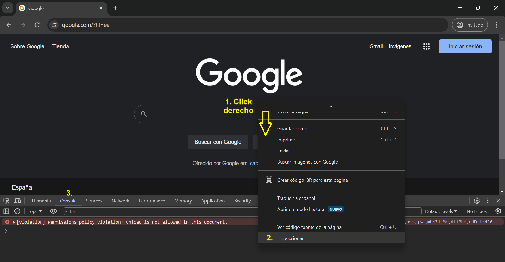

3. Escribe tu código de JavaScript. Verás cómo se ejecuta directamente.

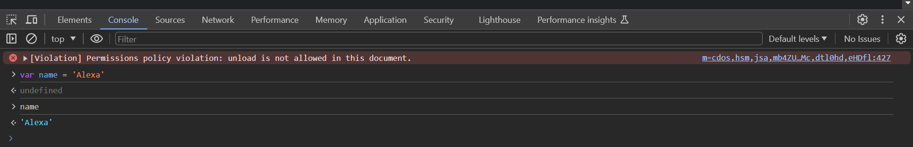

---

# 2. ¿Cuáles son algunos tipos de datos JS?

## 2.1. Tipos de datos

* **Number**: Representa valores numéricos, ya sea enteros o de punto flotante. 

    ```javascript
    let edad = 18;
    ```

* **String**: Representa cadenas de caracteres. Se pueden definir con comillas simples `' '` o dobles `" "`.

    ```javascript
    var nombre = 'Khaleesi';
    ```

* **Boolean**: Representa un valor de verdadero o falso. Los valores posibles son `true` o `false`.

    ```javascript
    let esVerdadero = true;
    ```

* **Null**: Representa la ausencia intencional de cualquier valor o referencia a un objeto. 

    ```javascript
    var valor = Null;
    ```

* **Undefined**: Representa una variable que ha sido declarada pero aún no se le ha asignado ningún valor.

    ```javascript
    var variableNoDefinida;
    ```

* **Symbol**: Es un tipo de datos proporciona una forma de crear identificadores únicos e inmutables, es decir, que no se puede cambiar después de haber sido creado. Se utiliza principalmente para propiedades de objeto que deben ser únicas.

    ```javascript
    var miSimbolo = Symbol('foo');
    ```

### 2.1.2. Estructuras de datos

* **Array**: estructura de datos que se utiliza para almacenar una colección de elementos, que pueden ser de cualquier tipo de datos (números, cadenas, booleanos, objetos u otros arrays). Se definen utilizando corchetes (`[]`) y pueden contener cero o más elementos separados por comas. 

    ```javascript
    var miArray = [1, 2, 3, 4, 5];
    ```

* **Objects**: estructura de datos que puede contener múltiples valores y funciones. Es una colección de pares de clave-valor, donde las claves son *strings* (o símbolos) y los valores pueden ser de cualquier tipo de dato, como números, cadenas, booleanos, arrays, otros objetos, funciones, etc. Se definen utilizando llaves (`{}`) y contienen cero o más pares de clave-valor, separados por comas. 

    En el siguiente ejemplo, tenemos el objeto `estudiante` con valores corespondientes a `nombre`, `edad` y `notas` de asignaturas.

    ```javascript
    let estudiante = {
        nombre: 'Khaleesi',
        edad: 18,
        notas: {
            python: 6,
            html: 10
        }
    }
    ```

## 2.2. Comprobación de tipos de datos

Para comprobar el tipo de dato de una variable o un valor, se puede emplear la función `typeof`.

1. **Number**

    ```javascript
    let edad = 18;
    typeof edad; // 'number' 

    typeof 12; // 'number' 
    ```

2. **String**

    ```javascript
    var nombre = 'Khaleesi';
    typeof nombre; // 'string' 

    typeof 'Hola'; // 'string' 
    ```

3. **Boolean**

    ```javascript
    let esVerdadero = true;
    typeof esVerdadero; // 'boolean' 

    typeof false; // 'boolean' 
    ```

4. **Undefined**

    ```javascript
    var variableNoDefinida;
    typeof variableNoDefinida; // 'undefined' 
    ```

5. **Symbol**

    ```javascript
    var miSimbolo = Symbol('foo');
    typeof miSimbolo; // 'symbol'
    ```

6. **Object** 

    ```javascript
    let estudiante = {
        nombre: 'Khaleesi',
        edad: 18,
        notas: {
            python: 6,
            html: 10
        }
    }

    typeof estudiante; // 'object'
    ```

## 2.3. ¡Pon en práctica lo aprendido!

Utiliza la consola de tu navegador para llevar a cabo los siguientes retos.

* **Reto 1**. Crea una variable `saludar` con el valor `"¡Hola! Bienvenida a este curso en JavaScript."`. 
* **Reto 2.**. Determina el tipo de variable que es `saludar`.

### Solución

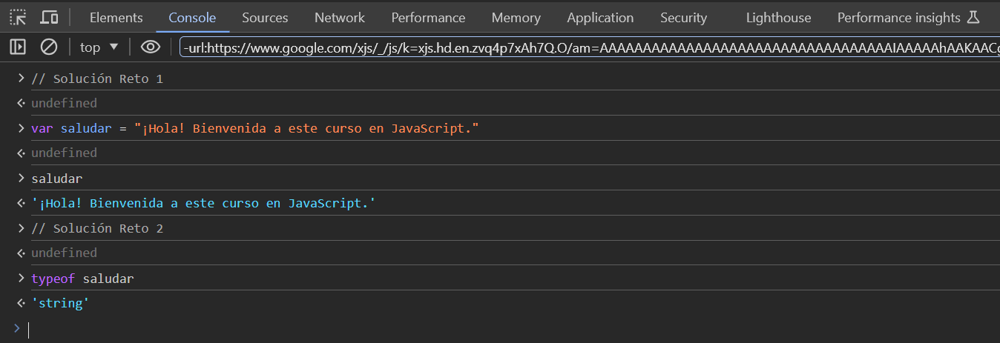

## 2.4. Bibliografía para profundizar

* [Tipos de datos: enlace 1](https://developer.mozilla.org/es/docs/Web/JavaScript/Data_structures)
* [Tipos de datos: enlace 2](https://es.javascript.info/types)

---

# 3. ¿Cuáles son las tres funciones de String en JS?

Podríamos clasificar las funciones de String en tres categorías según su función y uso: formato y conversión, búsqueda y comprobación, y manipulación de texto.

## 3.1. Funciones de String para formato y conversión

* **`length`**: Esta propiedad (no función) devuelve la longitud de la cadena, es decir, el número de caracteres que contiene.

    ```javascript
    var saludar = '¡Hola! Bienvenida a este curso en JavaScript.';

    saludar.length; // 45
    ```

    <p style= "background-color: #f26578;"><b>¡CUIDADO!</b> `length` no es una función, sino una propiedad, por lo que no lleva paréntesis.</p>

    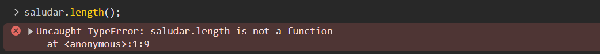

* **`charAt()`**: Este método devuelve el carácter en la posición especificada de la cadena. Si la posición está fuera del rango de la cadena, devuelve una cadena vacía.

    ```javascript
    var saludar = '¡Hola! Bienvenida a este curso en JavaScript.';

    saludar.charAt(0); // '¡'
    saludar.charAt(7); // 'B'
    saludar.charAt(50); // ''
    ```

* **`concat()`**: Este método se utiliza para concatenar una o más cadenas a la cadena original, devolviendo una nueva cadena que contiene la concatenación de todas las cadenas.

    ```javascript
    var saludar = '¡Hola! Bienvenida a este curso en JavaScript.';

    var nuevaCadena = saludar.concat(' ¿Cómo estás?');

    nuevaCadena; // "¡Hola! Bienvenida a este curso en JavaScript. ¿Cómo estás?"
    ```

* **`repeat()`**: Esta función se utiliza para crear y devolver una nueva cadena que contiene la cadena original repetida el número de veces especificado.

    ```javascript
    var saludar = '¡Hola! Bienvenida a este curso en JavaScript.';

    var saludarRepetida = saludar.repeat(3);
    saludarRepetida; // "¡Hola! Bienvenida a este curso en JavaScript.¡Hola! Bienvenida a este curso en JavaScript.¡Hola! Bienvenida a este curso en JavaScript."
    ```

## 3.2. Funciones de String para búsqueda y comprobación

* **`includes()`**: Este método comprueba si la cadena contiene la subcadena especificada, devolviendo `true` si la contiene y `false` si no. **Es sensible a mayúsculas.**

    ```javascript
    var saludar = '¡Hola! Bienvenida a este curso en JavaScript.';

    saludar.includes('Bienvenida'); // true
    saludar.includes('bienvenida'); // false
    saludar.includes('adiós'); // false
    ```

* **`endsWith()`**: Este método comprueba si la cadena termina con la subcadena especificada, devolviendo `true` si termina con ella y `false` si no. **Es sensible a mayúsculas.**

    ```javascript
    var saludar = '¡Hola! Bienvenida a este curso en JavaScript.';

    saludar.endsWith('JavaScript.'); // true
    saludar.endsWith('Hola'); // false
    ```

* **`startsWith()`**: Este método comprueba si la cadena comienza con la subcadena especificada, devolviendo `true` si comienza con ella y `false` si no. **Es sensible a mayúsculas.**

    ```javascript
    var saludar = '¡Hola! Bienvenida a este curso en JavaScript.';

    saludar.startsWith('¡Hola!'); // true
    saludar.startsWith('curso'); // false
    ```

* **`match()`**: Esta función busca una coincidencia entre una cadena y una [expresión regular](https://developer.mozilla.org/es/docs/Web/JavaScript/Guide/Regular_expressions) y devuelve un array con la información sobre la coincidencia.

    Supongamos que tenemos una cadena de texto y queremos encontrar todas las palabras que empiecen con la letra "c". Podemos usar una expresión regular para hacer esta búsqueda.

    ```javascript
    var texto = "El gato camina con cautela cerca del cofre.";

    texto.match(/\bc\w+/g); // ['camina', 'con', 'cautela', 'cerca', 'cofre']
    ```

    En caso de que no haya una coindicidencia, devuelve `null`. Supongamos ahora que queremos encontrar todas las palabras que empiecen con la letra "b". 

    ```javascript
    texto.match(/\bb\w+/g); // null
    ```

* **`search()`**: Este método busca una subcadena dentro de una cadena y devuelve la posición del primer carácter de la primera coincidencia encontrada.

    ```javascript
    var saludar = '¡Hola! Bienvenida a este curso en JavaScript.';

    saludar.search('Bienvenida'); // 7
    ```

* **`indexOf()`**: Este método busca una subcadena dentro de una cadena y devuelve la posición del primer carácter de la primera coincidencia encontrada.

    ```javascript
    var saludar2 = '¡Hola! Bienvenida a este curso en JavaScript. ¡Hola de nuevo!';

    saludar2.indexOf('Hola'); // 1
    ```

* **`lastIndexOf()`**: Este método busca una subcadena dentro de una cadena y devuelve la posición del primer carácter de la última coincidencia encontrada.

    ```javascript
    var saludar2 = '¡Hola! Bienvenida a este curso en JavaScript. ¡Hola de nuevo!';

    saludar2.lastIndexOf('Hola'); // 47
    ```

## 3.3. Funciones de String para manipulación de texto

* **`toUpperCase()`**: Este método convierte todos los caracteres de la cadena a mayúsculas.

    ```javascript
    var saludar = '¡Hola! Bienvenida a este curso en JavaScript.';

    saludar.toUpperCase(); // '¡HOLA! BIENVENIDA A ESTE CURSO EN JAVASCRIPT.'
    ```

* **`toLowerCase()`**: Este método convierte todos los caracteres de la cadena a minúsculas.

    ```javascript
    var saludar = '¡Hola! Bienvenida a este curso en JavaScript.';

    saludar.toLowerCase(); // '¡hola! bienvenida a este curso en javascript.'
    ```

* **`replace()`**: Este método busca una subcadena dentro de una cadena y la reemplaza por otra subcadena especificada.

    ```javascript
    var saludar = '¡Hola! Bienvenida a este curso en JavaScript.';

    saludar.replace('¡Hola!', 'Hello!'); // 'Hello! Bienvenida a este curso en JavaScript.'
    ```

* **`slice()`**: Este método devuelve una parte de la cadena, comenzando desde el índice especificado hasta el índice final (opcional), sin incluirlo.

    La sintaxis básica de `slice()` es la siguiente:
    
    ```javascript
    cadena.slice(inicio, final)
    ```

    Ejemplos:

    ```javascript
    var saludar = '¡Hola! Bienvenida a este curso en JavaScript.';

    // Fijarse en que se extrae hasta el caracter 5, sin incluirlo
    saludar.slice(1, 5); // 'Hola'

    // Extrae los últimos 11 caracteres
    saludar.slice(-11); // 'JavaScript.'

    // Extrae desde la posición 7
    saludar.slice(7); // 'Bienvenida a este curso en JavaScript.'
    ```

* **`trim()`**: Este método elimina los espacios en blanco al principio y al final de la cadena.

    ```javascript
    var saludar3 = ' ¡Hola! Bienvenida a este curso en JavaScript. ';

    saludar3.trim(); // '¡Hola! Bienvenida a este curso en JavaScript.'
    ```

## 3.4. Bibliografía para profundizar

[Aquí](https://www.w3schools.com/jsref/jsref_obj_string.asp) tienes una lista con todas las funciones de String en JavaScript.

---

# 4. ¿Qué es un condicional?

Hasta ahora hemos visto código que se ejecuta línea a línea, una detrás de otra. Pero a veces se hace necesario romper esa secuencia y crear ramas que nos permitan tomar diferentes caminos en el código dependiendo de ciertas condiciones. Para ello, se emplean las **condicionales**. Si ya has aprendido las condicionales en Python, aprenderlas en JavaScript no te supondrá ningún problema. 

## 4.1. Tipos de condicionales

### Condicional `if`

Sintaxis: 

```javascript
if (<condición>) {
  // código que se ejecuta si se cumple la condición
}
```

**Nota:** A las líneas que terminan con un corchete no se les agrega punto y coma (`;`).

Ejemplos:

```javascript
var edad = 20;
if (edad >= 18) {
    console.log("Eres mayor de edad");
}
```

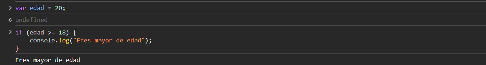

```javascript
var edadDos = '12';

if (edad === edadDos) {
  console.log('Las edades son iguales.');
}

if (edad !== edadDos) {
  console.log('Las edades no son iguales.');
}
```

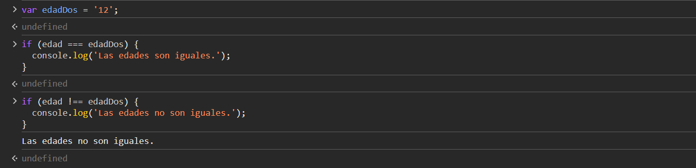

Como se puede ver, cuando la condición es falsa, no imprime nada.

¿Has observado algo que te haya llamado la atención? ¿Algo que difiere con el lenguaje de programación de Python? Si te has fijado en los **operadores de igualdad** para realizar las comparaciones, estás en lo correcto. 

### Extra: Operadores de igualdad

En JavaScript, `==` y `===` son operadores de igualdad que se utilizan para comparar valores. La diferencia principal entre ellos radica en cómo realizan la comparación:

* `==` (igualdad débil): Este operador comprueba si los valores son iguales **después** de realizar la conversión de tipo si es necesario. Si los valores no son del mismo tipo, JavaScript intentará convertir uno o ambos valores al mismo tipo antes de realizar la comparación. 

    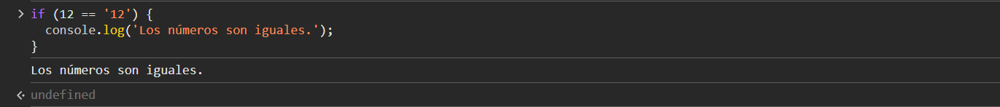

* `===` (igualdad estricta): Este operador también comprueba si los valores son iguales, pero **no realiza la conversión de tipo**. Esto significa que los valores deben ser del mismo tipo y tener el mismo valor para que la comparación se evalúe como verdadera. 

    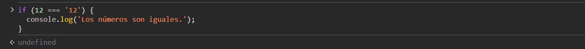

Es importante tener en cuenta esta diferencia al realizar comparaciones en JavaScript para evitar resultados inesperados debido a la coerción de tipos. En general, se recomienda utilizar `===` (igualdad estricta) siempre que sea posible, ya que proporciona resultados más predecibles y ayuda a evitar errores sutiles relacionados con la conversión de tipos.

### Condicional `if ... else` 

Opción a realizar cuando al condición es falsa.

Sintaxis:

```javascript
if (<condición>) {
  // código que se ejecuta si se cumple la condición
} else {
  // código que se ejecuta si la condición es falsa
}
```

Ejemplo:

```javascript
var edad = 20;
var edadDos = '12';

if (edad === edadDos) {
  console.log('Las edades son iguales.');
} else {
  console.log('Las edades no son iguales.');
}
```

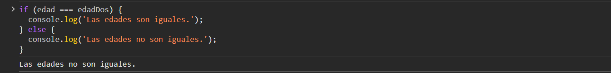

Está perfectamente permitido poner una declaración `if...else` dentro de otra declaración `if...else` — para anidarlas.

```javascript
var edad = 15;
if (edad >= 18) {
    console.log("Eres mayor de edad");
} else {
    if (edad >= 13) {
        console.log("Eres adolescente");
    } else {
        console.log("Eres niño/a/e");
    }
}

// Eres adolescente
```

### Condicional `else if`

En general, es preferible no tener que anidar condicionales porque son difíciles de leer y entender. Otro atajo que nos ofrece JavaScript para los condicionales es el `else if`, que significa "De lo contrario, si ..." en Inglés. 

Sintaxis:

```javascript
if (<primera condición>) {
  // código que se ejecuta si <primera condición> se cumple
} else if (<segunda condición>) {
  // código si <primera condición> NO se cumple, pero <segunda condición> se cumple
} else if (<tercera condición>) {
  // código si <primera condición> y <segunda condición> NO se cumplen, pero <tercera condición> sí se cumple
} else {
  // código si ninguna de las condiciones se cumple
}
```

Modifiquemos nuestro ejemplo anterior y, en vez de utilizar condiciones anidadas, utilicemos `else if`:

```javascript
if (edad >= 18) {
    console.log("Eres mayor de edad");
} else if (edad >= 13) {
    console.log("Eres adolescente");
} else {
    console.log("Eres niño/a/e");
}
```

### Extra: Operadores lógicos: AND y OR 

Los operadores lógicos son muy útiles en condiciones:

* **&&** — AND; permite encadenar dos o más expresiones para que **todas** ellas se tengan que evaluar individualmente `true`, para que expresión entera retorne `true`.

    | Expresión         | Resultado |
    |--------------     |-----------|
    | `true && true`    | `true`    |
    | `true && false`   | `false`   |
    | `false && true`   | `false`   |
    | `false && false`  | `false`   |

    Ejemplo:

    ```javascript
    if (edad >= 18) {
        console.log("Eres mayor de edad");
    } else if (edad >= 13 && edad < 18) {
        console.log("Eres adolescente");
    } else {
        console.log("Eres niño/a/e");
    }
    ```

* **||** — OR; permite encadenar dos o más expresiones para que **una o más** de ellas se tengan que evaluar individualmente `true`, para que expresión entera retorne `true`.

    | Expresión         | Resultado |
    |--------------     |-----------|
    | `true \|\| true`    | `true`    |
    | `true \|\| false`   | `true`   |
    | `false \|\| true`   | `true`   |
    | `false \|\| false`  | `false`   |

    Ejemplo:

    ```javascript
    if (edad >= 18) {
        console.log("Eres mayor de edad");
    } else if (edad < 18 || edad >= 13) {
        console.log("Eres adolescente");
    } else {
        console.log("Eres niño/a/e");
    }
    ```

### Declaración `switch`

El condicional `if...else` hace un buen trabajo permitiéndonos realizar un buen código, pero esto viene con sus desventajas. Hay variedad de casos donde necesitarás realizar varias elecciones, y cada una requiere una cantidad razonable de código para ser ejecutado y/o sus condicionales son complejas (por ejemplo, operadores lógicos múltiples). Para los casos en los que solo se desea establecer una variable para una determinada opción de valores o imprimir una declaración particular dependiendo de una condición, la sintaxis puede ser un poco engorrosa, especialmente si se tiene una gran cantidad de opciones.

Para estos casos los `switch statements` son de gran ayuda. Toman una sola expresión / valor como una entrada, y luego pasan a través de una serie de opciones hasta que encuentran una que coincida con ese valor, ejecutando el código correspondiente que va junto con ella.

<div style="text-align: center;">
    
</div>

Sintaxis:

```javascript
switch (<expresion>) {

  case valor1:
    // Bloque de código a ejecutar si expresion es igual a valor1
    break;

  case valor2:
    // Bloque de código a ejecutar si expresion es igual a valor2
    break;

  ...

  default:
    // Bloque de código a ejecutar si expresion no coincide con ningún caso
}
```

Ejemplo:

```javascript
var dia = 1;
var nombreDia;

switch (dia) {
  case 1:
    nombreDia = "Lunes";
    break;
  case 2:
    nombreDia = "Martes";
    break;
  case 3:
    nombreDia = "Miércoles";
    break;
  case 4:
    nombreDia = "Jueves";
    break;
  case 5:
    nombreDia = "Viernes";
    break;
  case 6:
    nombreDia = "Sábado";
    break;
  case 7:
    nombreDia = "Domingo";
    break;
  default:
    nombreDia = "Día inválido";
}

console.log("Hoy es " + nombreDia);
```

En este ejemplo, `dia` tiene un valor de 1, por lo que se ejecuta el primer caso y `nombreDia` se establece en "Lunes". Si `dia` tuviera un valor diferente, se ejecutaría el caso correspondiente o, si no hay coincidencia, se ejecutaría el caso `default`.

## 4.2. ¡Pon a prueba lo aprendido!

* **Reto 1**. ¿Qué imprimiría el siguiente código?

    ```javascript
    var autor = "Terry Pratchett";
    var paginas = 203;

    if (autor == "Sarah J. Maas" || (paginas > 200 && paginas < 900)) {
        console.log("Me lo llevo!");
    } else {
        console.log("Paso!");
    }
    ```

* **Reto 2**. Crea un programa que verifique si un número es par o impar y que luego imprima un mensaje en la consola con el resultado.

### Solucioones

* **Reto 1**.

    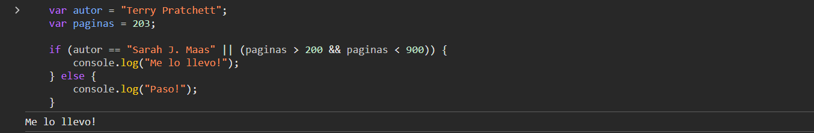

* **Reto 2**.

    ```javascript
    // Definimos el número que queremos verificar
    var numero = 7;

    // Verificamos si el número es par o impar
    if (numero % 2 === 0) {
        // Si el residuo de dividir el número entre 2 es 0, entonces es par
        console.log(numero + " es un número par");
    } else {
        // Si no es par, entonces es impar
        console.log(numero + " es un número impar");
    }
    ```

## 4.3. Bibliografía para profundizar

* [Condicionales](https://developer.mozilla.org/es/docs/Learn/JavaScript/Building_blocks/conditionals)
* [Declaración `switch`](https://developer.mozilla.org/es/docs/Web/JavaScript/Reference/Statements/switch)

---

# 5. ¿Qué es un operador ternario?

Un operador ternario es un operador que toma tres operandos y se utiliza para evaluar una expresión condicional de una manera más concisa que una declaración `if...else`. También se le conoce como operador condicional.

Es muy práctico, legible e ideal para códigos pequeños donde almacenamos la información en una variable para luego utilizarla.

La sintaxis básica del operador ternario en JavaScript es la siguiente:

```javascript
<condición> ? <expresiónSiVerdadero> : <expresiónSiFalso>
```

Donde:
- `<condición>` es una expresión que se evalúa como verdadera o falsa.
- `<expresiónSiVerdadero>` es la expresión que se devuelve si la condición es verdadera.
- `<expresiónSiFalso>` es la expresión que se devuelve si la condición es falsa.

Ejemplo:

```javascript
var edad = 20;

// if (edad >= 18) {
//    console.log("Eres mayor de edad");
//} else {
//    console.log("Eres menor de edad");
//}

var mensaje = edad >= 18 ? "Eres mayor de edad" : "Eres menor de edad";

console.log(mensaje); // "Eres mayor de edad"
```

En este ejemplo, si la variable `edad` es mayor o igual a 18, se asigna el mensaje "Eres mayor de edad" a la variable `mensaje`; de lo contrario, se asigna el mensaje "Eres menor de edad".

## 5.1. Anidar múltiples operadores ternarios

Es posible anidar múltiples operadores ternarios para manejar condiciones más complejas. Sin embargo, anidar demasiados operadores ternarios puede dificultar la legibilidad del código, por lo que es importante usarlos con moderación y considerar si una estructura `if...else` podría ser más clara en ciertos casos.

Ejemplo:

```javascript
var temperatura = 25;
var llueve = false;

var decision = (temperatura > 20) ? "Hace calor" : (llueve) ? "Hace frío y llueve" : "Hace fresco";

console.log(decision); // Output: "Hace calor"
```

En este ejemplo, se evalúa la temperatura y, si es mayor que 20 grados, se imprime "Hace calor". Si no es mayor que 20 grados, se verifica si está lloviendo. Si está lloviendo, se imprime "Hace frío y llueve", de lo contrario, se imprime "Hace fresco".

## 5.2. ¡Pon en práctica lo aprendido!

Supongamos que tienes una variable llamada `puntos` que representa la puntuación de un jugador en un juego. Queremos imprimir un mensaje que diga "Ganaste" si la puntuación es mayor o igual a 100, y "Perdiste" en caso contrario. Haz uso del operador ternario.

### Solución

```javascript
var puntos = 120;
var mensaje = (puntos >= 100) ? "Ganaste" : "Perdiste";
console.log(mensaje); // Ganaste
```

---

# 6. ¿Cuál es la diferencia entre una declaración de función y una expresión de función?

La principal diferencia entre una declaración de función y una expresión de función es cómo son creadas y su comportamiento en relación con el "hoisting" y la disponibilidad en el código.

## 6.1. Declaración de función

Una declaración de función es una forma tradicional de definir una función en JavaScript. Empieza con la palabra clave `function`, seguida por el nombre de la función y sus argumentos entre paréntesis `()`, y luego un bloque de código entre llaves `{}` que contiene las instrucciones que ejecuta la función.

<div style="text-align: center;">
    
</div>

Las declaraciones de funciones son "levantadas" o **"hoisted"** al principio del contexto de ejecución, lo que significa que pueden ser llamadas incluso antes de que se declaren en el código.

En este siguiente ejemplo, la función `saludar()` es llamada antes de que se declare en el código. Sin embargo, debido al "hoisting", la función es "levantada" al principio del ámbito de alcance, por lo que la llamada a `saludar()` funciona correctamente y se imprime "¡Hola!" en la consola.

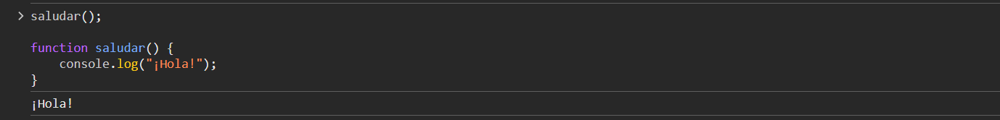

## 6.2. Expresión de función

Una expresión de función es una forma de definir una función utilizando una expresión, que puede ser asignada a una variable u otro tipo de estructuras de datos. En una expresión de función, el nombre de la función es opcional (función anónima), aunque se puede proporcionar un nombre para facilitar la recursividad y la depuración.

<div style="text-align: center;">
    
</div>

Las expresiones de funciones **no son "hoisted"** como las declaraciones de funciones. Esto significa que solo están disponibles para su uso después de que se ha asignado la expresión a una variable.

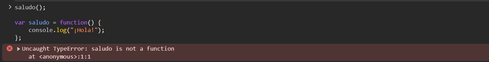

## 6.3. ¡Practica lo aprendido!

Realiza la declaración y la expresión de una función cuyos dos argumentos se devuelvan sumados.

### Solución

```javascript
// Declaración de función
function sumar(a, b) {
    return a + b;
}

// Expresión de función
var sumar = function(a, b) {
    return a + b;
}
```

## 6.4. Bibliografía para profundizar

* [Decalaración de funciones](https://es.javascript.info/function-basics)
* [Expresión de funciones](https://es.javascript.info/function-expressions)

---

# 7. ¿Qué es la palabra clave "this" en JS?

La **palabra clave `this`** en JavaScript se refiere al objeto al que pertenece el contexto actual de ejecución. En otras palabras, `this` hace referencia al objeto en el que se está ejecutando el código en un momento dado.

La referencia de `this` puede variar dependiendo del contexto en el que se use. Algunos de ellos pueden ser:

* **En el contexto global**: En el contexto global, fuera de cualquier función, `this` se refiere al objeto global, que es `window` en un navegador web y `global` en Node.js (entorno de ejecución que se utiliza para ejecutar JavaScript fuera del navegador).
    Si ejecutas en la consola del navegador

    ```javascript
    console.log(this); 
    ```
    obtienes, expandiendo:
    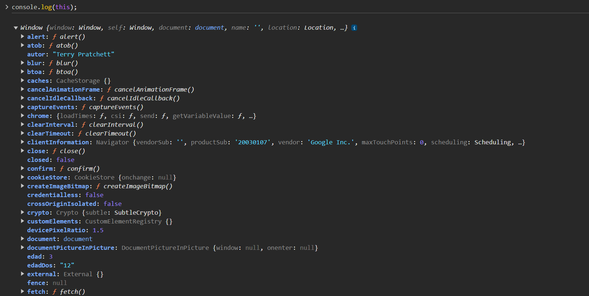

* **En el contexto de una función como método de un objeto**: Dentro de una función, si la función se invoca como un método de un objeto, `this` se refiere al objeto que contiene el método.

    Conceptualmente, esto es similar a un pronombre en inglés porque se usa para referirse a un objeto (*this*), tal como un pronombre se refiere a un sustantivo. Por ejemplo: “Mary is running fast because she is trying to catch the bus”. En esa declaración, el pronombre "she" se usa para referirse al antecedente (el sustantivo al que se refiere un pronombre) "Mary". Relacionemos este concepto con la palabra clave `this`.

    ```javascript
    const person = {
    name: "Mary",
    pronoun: "she",    
    Activity: function () {
        // this = person
        console.log(`${this.name} is running fast because ${this.pronoun} is trying to catch the bus`)
        }
    }

    person.Activity() //  Mary is running fast because she is trying to catch the bus
    ```

* **En el contexto de una función constructora**: Dentro de una [función constructora](https://www.geeksforgeeks.org/javascript-classes/), `this` se refiere a la instancia recién creada del objeto de clase.

    ```javascript
    class Person {
        constructor(name) {
            this.name = name;
        }
    }

    var mary = new Person("Mary");

    console.log(mary.name); // 'Mary'
    ```

## 7.1. Bibliografía para profundizar

* [Enlace 1](https://blog.openreplay.com/javascripts-this-explained-and-demystified/)
* [Enlace 2](https://developer.mozilla.org/es/docs/Web/JavaScript/Reference/Operators/this)